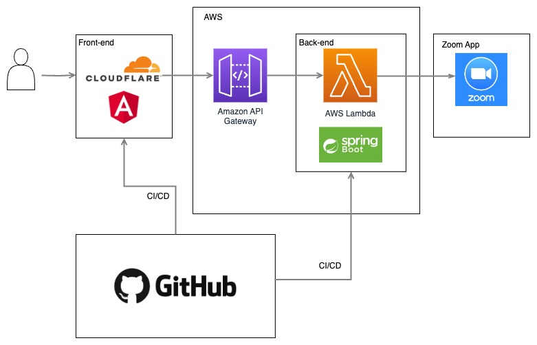
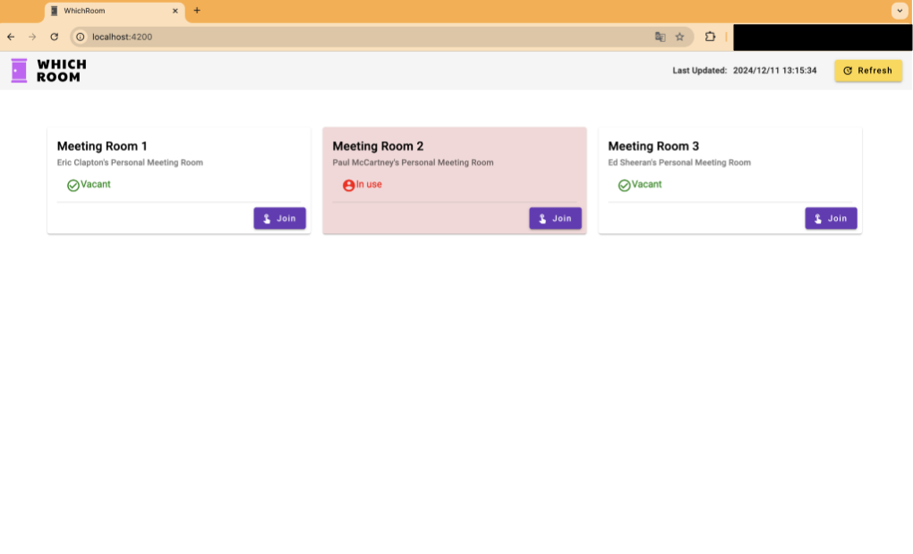

# Which Room Client

The **Which Room Client** is a front-end application designed to check Zoom room availability. It works in conjunction with the [Which Room API](https://github.com/goothrough/which-room-api-public), providing an easy way to find and manage available rooms.

## Features

- User-friendly interface for checking Zoom room availability
- Seamless integration with the [Which Room API](https://github.com/goothrough/which-room-api-public)
- Easily manage room availability and join the meeting.

## Architecture Diagram

The following diagram illustrates the architecture of the Which Room application:



## How It Works

The following image demonstrates how the application looks and functions:



## Technologies Used

The development and deployment of the Which Room Client involve the following skills and technologies:

- **Frontend Development**: Angular, TypeScript
- **Styling**: Angular Material
- **Cloud Services**: Cloudflare
- **Version Control**: GitHub
- **API Integration**: RESTful APIs([Which Room API](https://github.com/goothrough/which-room-api-public))
- **Deployment**: GitHub Actions workflows for deploying to Cloudflare

## Prerequisites

Before setting up the client, ensure the following:

1. The [Which Room API](https://github.com/goothrough/which-room-api-public) is running and accessible.
2. Create a Zoom app following the link below.  
    https://developers.zoom.us/docs/build-flow/


## Installation

1. Clone the repository:

   ```bash
   git clone https://github.com/goothrough/which-room-client-public.git
   ```

2. Navigate to the project directory:

   ```bash
   cd which-room-client-public
   ```

3. Install dependencies:

   ```bash
   npm install
   ```

## Running the Application

To start the development server, run:

```bash
ng serve
```

The application will be available at `http://localhost:4200` by default.

## Building for Production

To build the client for production, run:

```bash
ng build --prod
```

The production build will be available in the `dist/` directory.

## Deployment

1. Upload the contents of the `dist/` directory to your hosting service.
2. Ensure the environment variables are properly configured on the server.

## Acknowledgments

This project was developed to simplify Zoom room availability management by integrating a powerful back-end API with an intuitive front-end interface.
